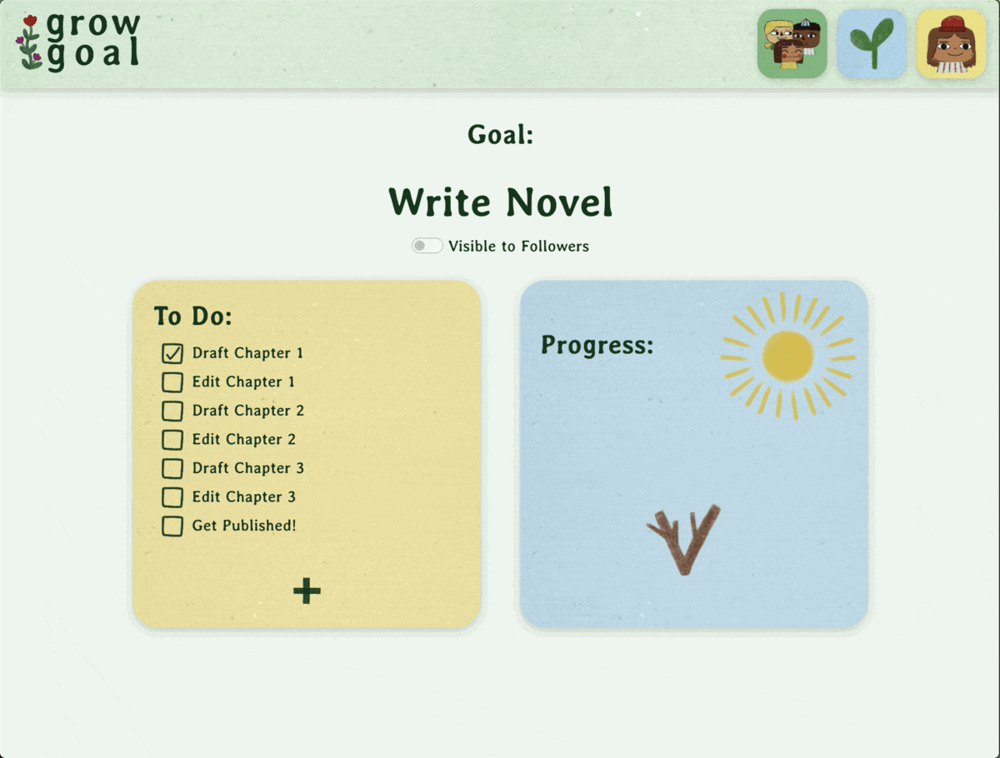

# GROW GOAL
The to-do app that lets you visualize your goals as adorable growing plants! Add your goals, like "Make a Video Game" or "Gain 5lbs of Muscle", then add tasks that will help you accomplish each goal. Choose a cute plant avatar to represent your progress, and watch it grow as you complete each task!

## Features

- Choose from many custom illustrated plant avatars
- Customize your profile picture 
- Add friends, and choose whether to keep each of your goals private or viewable to them
- Visit friends' pages to view and like their goal progress

## Built With

## Thank You 

Thank you to my instructors and friends at Prime, my partner Mike, and my friend Matthew Schufman for the illustrations